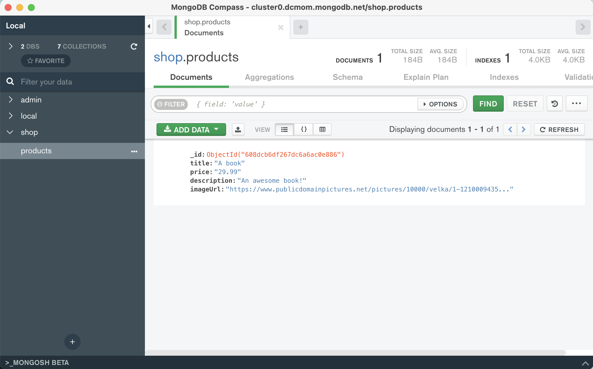

# nodejs-complete-guide
This is the study material from Maximilian of class in Udemy.
### main branch
This is study project, which is book shop page using `mysql` database with nodejs.

### mongodb branch
This is changed database from mysql to `mongodb`.
Open mongodb cloud account and connect with yours.

### mongodb compass

### mongodb shell methods docs
https://docs.mongodb.com/manual/reference/method/js-collection/

### useful resource

- MongoDB Official Docs: https://docs.mongodb.com/manual/core/security-encryption-at-rest/https://docs.mongodb.com/manual/

- SQL vs NoSQL: https://academind.com/learn/web-dev/sql-vs-nosql/

- Learn more about MongoDB: https://academind.com/learn/mongodb